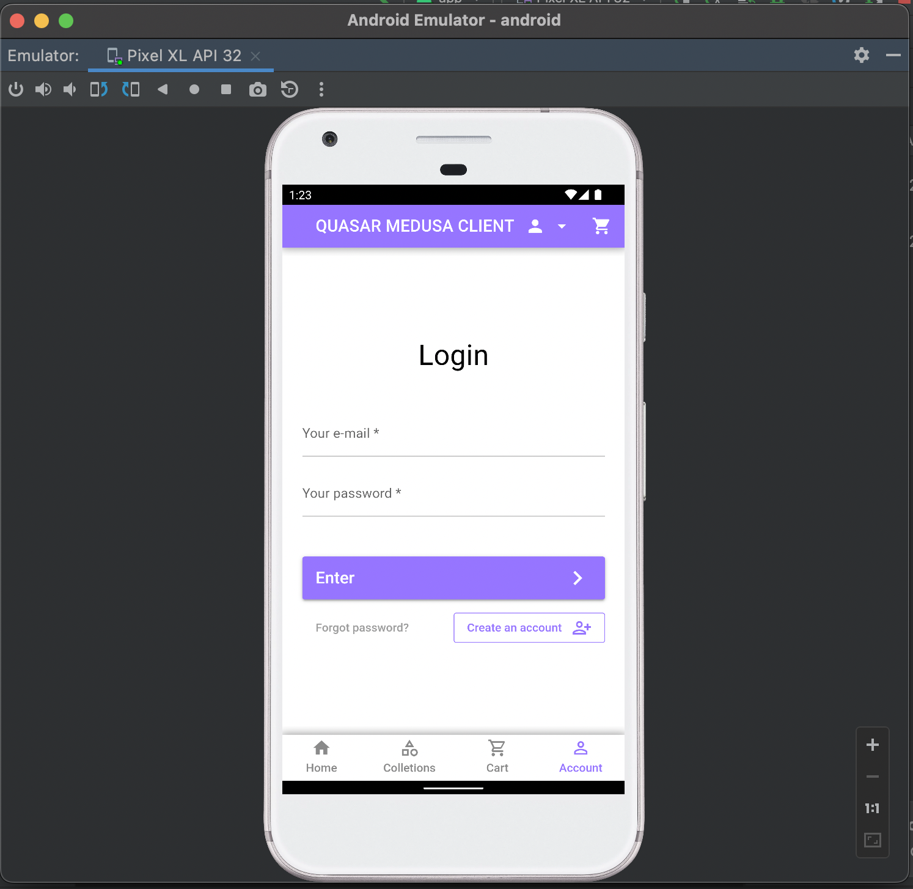

# Medusa Ecommerce Vue 🛒


## About


### Participants

Patrick Monteiro - [@patrickmonteiro](https://github.com/patrickmonteiro)

Luique Cruz - [@Luiquecruz](https://github.com/Luiquecruz)

### Description

Online store with Medusajs and Quasar Framework(SPA, PWA, App Android/iOS and Desktop with Electron)

### Preview

Desktop Browser


**3D Mobile View**
- Access the app using the QRCode above and point the camera at the Sandal. We have few examples available.


Mobile Browser


App Desktop with Electron


Hybrid app with Capacitor



## Set up Project

### Prerequisite
Node v14.0 or higher.

## Install Project

## **medusa-cli**

First install medusa cli in your environment

```
yarn global add @medusajs/medusa-cli
```
---
## **medusa-server**
Headless: Medusa is a highly customizable commerce API which means that you may use any presentation layer such as a website, app, chatbots, etc.

[Quickstart Medusa Server 🔗](https://docs.medusajs.com/quickstart/quick-start/)

Start development environment:
```
yarn start
```
or
```
medusa develop
```
---
## **medusa-admin**

The Medusa Admin provides you with a lot of functionalities and configurations such as Product Management, Order Management, Discounts and Promotions, and more.

[Quickstart Medusa Admin 🔗](https://docs.medusajs.com/admin/quickstart/)

Start development environment:

```
yarn start
```
---
## **quasar-medusa-client**

A client built with Quasar Framework with version 3 of Vuejs.

[Getting Started Quasar 🔗](https://quasar.dev/start/quasar-cli)

By default the **web mode** is what will work in your traditional environment.
For the other modes, you will need to configure the development environment as per the Quasar documentation.

Install **Quasar CLI** and then start the application with the command:

```
quasar dev
```

For PWA mode:

```
quasar dev -m pwa
```

For Capacitor mode:

```
quasar dev -m capacitor -T android
```

For desktop mode with electron:

```
quasar dev -m electron
```

## Resources
- [Medusa’s GitHub repository 🔗](https://github.com/medusajs/medusa)
- [Medusa Admin Panel 🔗](https://github.com/medusajs/admin)
- [Medusa Documentation 🔗](https://docs.medusajs.com/)
- [Getting Started Quasar 🔗](https://quasar.dev/start/quasar-cli)
